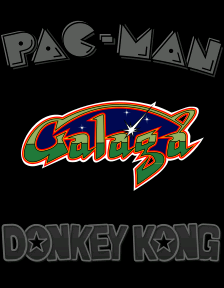
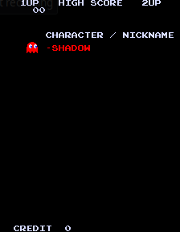
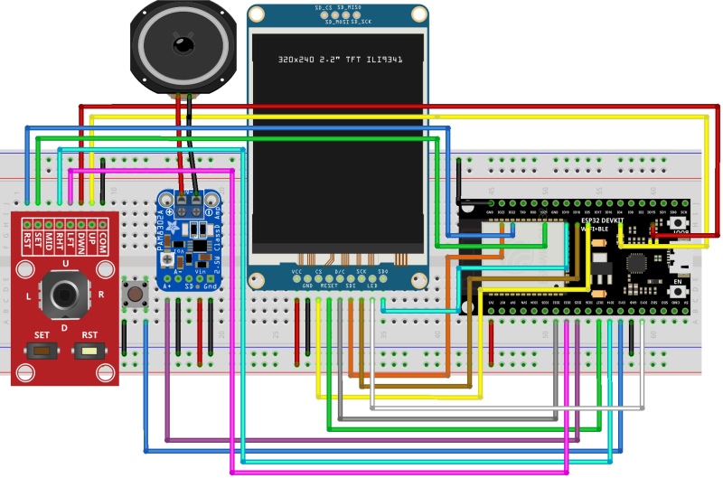

# Galagino

Galaga, Pac-Man and Donkey Kong for the ESP32

## Arcade emulator for ESP32

[Pac-Man](https://en.wikipedia.org/wiki/Pac-Man),
[Galaga](https://en.wikipedia.org/wiki/Galaga) and
[Donkey Kong](https://en.wikipedia.org/wiki/Donkey_Kong_(video_game)) are three of the most
iconic arcade machines of all times and are listed on place #1 to #3
on the [Killer List of Video Games](http://www.klov.net).

Especially Pac-Man and Galaga have been remade and emulated many
times. So far the cheapest and smallest system able to do a faithful
emulation of the original arcade machines was the raspberry pi. But
even the much cheaper ESP32 should be able to easily emulate a machine
from the early ’80s, shouldn't it?

Well, things are not that easy. The Galaga arcade was driven by three
Z80 CPUs, each running at 3Mhz. Additionally the arcade machine
included two more CPUs for button and coin handling and for audio
support. And finally the hardware itself had dedicated support
for simple wavetable audio, tilemap graphics and up to 64 sprites.
The video resultion was 224 by 288 pixels. The ESP32 on the other hand
comes with two cores running at 240MHz. But it lacks dedicated video
hardware. Emulating the various CPUs as well as the handling of
audio and graphics turned out to be challenging for the ESP32.

Cheap TFT screens with a resolution of 320 by 240 pixels are avaialable
in various sizes from 2.0 inch to 3.2 inch allowing for a very small
and cheap *galagino* setup.

These small displays usually allow for SPI clock rates of up to 40MHz
allowing for a max screen refresh rate of ~30Hz. This is exactly half
the refresh rate of the original arcade machine. 30Hz is sufficient
for a very fluid gameplay. However, with displays coping with 80MHz
SPI clock, Galagino will run at full 60Hz refresh.

Later in this project the first and third placed games on the Killer List
of Video games were added together with a little menu at startup.

## Youtube videos

* [First test](https://www.youtube.com/shorts/LZRI6izM8XM)
* [Sound and Starfield working](https://www.youtube.com/shorts/8uNSv0aRtgY)
* [Finally playable](https://www.youtube.com/shorts/wqnJzOAAths)
* [Pac-Man on Galagino](https://www.youtube.com/shorts/F4-XiiPwG1c)
* [Donkey Kong on Galagino](https://www.youtube.com/shorts/KROFJ0Rtj0w)
* [Boot menu](https://www.youtube.com/shorts/_PJyn06yrtg)
* [Cardboard cabinet](https://youtube.com/shorts/vverV4NphlQ)

## Hardware

The hardware is built around one of those cheap ESP32 development
boards like the ESP32 Devkit V4 depicted in the images below. The
components needed for the breadboard setup are listed below. If you
plan to build the [cabinet](hardware/cabinet) instead you might want
to make sure you [order the exact parts](./hardware) to make sure they
aren't only electrically compatible but also mechanically.

* ESP32 development board (e.g. [Devkit V4](https://www.espressif.com/en/products/devkits/esp32-devkitc))
* A 320x240 SPI TFT screen (no touch needed)
  * Either a ILI9341 based screen as depicted, or
  * a ST7789 based screen with 320x240 pixels
* An audio amplifier and speaker
  * e.g. a [PAM8302A](https://www.adafruit.com/product/2130) and a 3W speaker (as seen in the photos), or
  * a [Keyestudio SC8002B](https://www.keyestudio.com/products/keyestudio-sc8002b-audio-power-amplifier-speaker-module-for-arduino-player), or similar 
* five push buttons, or
* one push button and a five way joystick breakout (for Pac-Man and Donkey Kong)
* breadboard and wires

The entire setup should be connected as depiced below. The Devkit is
too wide for the breadboard leaving no space above it to connect
wires. Thus the wires going to the top pin row of the Devkit are
placed underneath the DevKit with the connections done as shown in the
image below. See [galagino/config.h](galagino/config.h) for the button
mappings.

[PDF](images/galagino_bb.pdf)

This setup with five buttons works fine for Galaga since there is no
vertical movement in the game that requires a joystick. A joystick may
be needed for other games like Pac-Man and Donkey Kong. The setup would
the be wired in the following way:

[PDF](images/galagino_5way_bb.pdf)

## Software

The software consists of three parts:

* The [Galagino specific code](galagino/) contained in this repository
* The orignal ROM files
    * [Galaga Namco Rev. B ROM](https://www.bing.com/search?q=galaga+namco+b+rom)
    * [Pac-Man (Midway)](https://www.bing.com/search?q=pacman+midway+arcade+rom)
    * [Donkey Kong (US set 1)](https://www.bing.com/search?q=donkey+kong+arcade+rom)
* A [Z80 software emulation](https://fms.komkon.org/EMUL8/Z80-081707.zip)

Galagino uses code that is not freely available and thus not included in this
repository. Preparing the firmware thus consists of a few additional steps:

* The ROM files have to be placed in the [roms directory](roms/), together with the ZIP file containing the Z80 emulator.
* A set of [python scripts](romconv/) is then being used to convert and
 patch the ROM data and emulator code and to include the resulting code into the
galagino sketch directory.
* The same scripts are afterwards being used to convert [audio sample files](./samples) into the desired format.

The [ROM conversion](./romconv) as well as the [audio sample
conversion](./samples) create a whole bunch of additional files in the
[galagino directory](./galagino). Please check the README's in the
[romconv](./romconv) and [samples](./samples) directories for further
instructions.

With all these files in place, the galagino.ino sketch can be loaded
into the [Arduino IDE](https://docs.arduino.cc/software/ide-v2). The
Arduino IDE must have the [ESP32 board support](https://docs.espressif.com/projects/arduino-esp32/en/latest/installing.html)
installed and the appropriate board like e.g. the
*ESP32 Dev Module* should be selected. Finally the default core used
by Arduino should be 1 (this is the default) as Galagino will use core 0
for audio and video emulation.

## Configuration

The Galagino code can be configured through the [galagino/config.h](galagino/config.h)
file. This is also the place where it's possible to choose between the ILI9341
controller (default) and the ST7789.

Also the pin assignment can be adjusted as well as the TFT SPI clock.

## Improvements

Galagino runs fluid and plays perfectly. Still a few things could be optimized.

* ~~Displays allowing for 80MHz SPI clock could run the video at full 60Hz~~ done
* ~~The SPI display update could be done using DMA which would significantly reduce the load on ESP32 core 0~~ done
* [VGA output](http://www.fabglib.org/index.html) could be used to drive a VGA screen
* The ESP32's bluetooth could be used to connect to a wireless gamepad
* Galagino could be ported to the [Raspberry Pi Pico and the DVI sock](https://picockpit.com/raspberry-pi/raspberry-pi-pico-video-output/)
